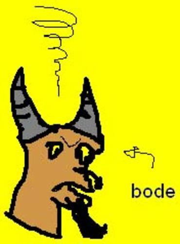

O monstro tinha suas fases. Como todo bom garoto de classe média, decidiu ter uma fase punk. Passava seus dias com camisetas pretas, falando de anarquia e arrastando correntes. Comprou um skate, arrepiou o cabelo, matou um gato e deixou suas unhas crescerem. Foi então que ele realizou que a banda que ele ouvia chamava-se "Gangrena Gasosa" e que seu disco predileto era dos "Garotos Podres". Ao prestar atenção nas letras então, ele soltou um muxoxo e ficou desapontado pelo resto do dia. Então ele saiu, comprou um boné da Guess e passou a ouvir música Dance.

Foi um dia, não se sabe quando, o monstro começou a ter insônia. Ficou sete meses sem dormir. Ele tentou de tudo para resolver seu problema; simpatia, mandinga, maracujá, sonífero, paulada, aulas de CFC, documentários de savana do Discovery Channel, contagem de carneirinhos, contagem de bodes, contagem de guaxinins e outras mais, livros do Eça de Queiroz, jogos de xadrez, horário político, Jazz, músicas new age, Porcelain, musicais em branco e preto dos anos 50 e hipnose. Nada adiantava. Foi quando ele ouviu falar de Kotler, comprou seu livro e nunca mais teve problemas com falta de sono.

Deu-se que o monstro queria porque queria tatuar o capitão Cluster no braço direito. Bem na região do bíceps, ou seja lá qual for o nome monstro para esse músculo. Aliás, toda vez que ele comia caqui, três músculos diferentes do seu braço tinham espasmos involuntários. Espasmos que nem aqueles quando se usa um desfibrilador na cabeça de alguém. O monstro já havia ido para um café cabeça. Lá ele estalava os dedos em vez de bater palmas. O monstro não conhecia a capital do Tocantins. Descobriu isso numa na primeira vez que foi surfar nas Bahamas. Na mesma viagem em que conheceu uma nativa chamada Nah-ap-luh, que o ensinou o caminho definitivo da energia e da luz. E, por lembrar, havia acabado a luz no bangalô do monstro nessa época. Era época de colheita no Rio Grande do Sul. Colhiam laranjas, mas não laranjas mecânicas, que é um filme do Kubrick. O Kubrick era meio esquisitão, que nem um professor de filosofia do monstro. Ele o ensinou os pensadores antigos, modernos, e, quando estavam bêbados, também o caminho de volta pra casa. Sua casa por essas eras tinha estado povoada por cupins. A maior infestação que já ocorrera. Um deles chamava-se Rubens, o malfeitor. E ele era fã de starwars. E o monstro nunca entendera a natureza das chewbacas. Muito menos dos Ewoks. Por isso preferia a jornada nas estrelas. Seu avô era um militante político que lutava por uma jornada de trabalho mais digna. Ele colava parafusetas e trabalhava de funileiro, que, aliás, foi a primeira profissão do coronel McNamara, que era amigo íntimo do capitão Cluster, que o monstro queria tatuar no braço.

Capítulo 17 - De Profundi

Na misteriosa casa da Senhorita Fynn, um caso macabro tomava lugar. Sorrateiro, primeiro sentou ao lado do Sr. Fynn e pouco tempo após tomou seu lugar. O Sr. Fynn era um homem amargo, rancoroso, que dançava tristes boleros e conheceu Getúlio Vargas. Já a senhorita Fynn jogava buraco aos sábados, falava francês e ajudava entidades filantrópicas, além de fazer um barulho esquisito quando espirrava. O Monstro conheceu ambos numa convenção em Cincinatti, e tentou comê-los. Mas, desfeito o engano, eles se tornaram grandes amigos, e mediam agora três metros cada um.

Enquanto a Senhorita Fynn discutia dialética quântica com seu pônei, o Monstro e o Sr. Fynn brigavam pela última batata. Finalmente o Monstro cravou o garfo na dorsal do Sr. Fynn, riu bem alto e devorou o prêmio. E os dois saíram para encontrar o correligionário Juarez Garcia y Garcya, jogar Cricket e rememorar os bons tempos quando eles assassinavam, roubavam e espalhavam o caos e a desordem pelo mundo. O Sr. Fynn era conhecido outrora por 'Billy the Trouble', o correligionário por 'John the Mean' e o Monstro tinha por alcunha 'The Incredible Stone Eater Green Monster'. A origem desse codinome é ignota até mesmo para os mais profundos conhecedores do Monstro.

Agora, passados os saudosismos, conversavam sobre como eles iriam se tornar Lordes. Precisariam arrebanhar uma legião de cavaleiros fiéis, conquistar o leste da Espanha e criar um reinado independente. Mas desistiram quando souberam que estava na moda conquistar territórios inférteis de países europeus.

Por essas, a Senhorita Fynn exaltava-se com o pônei, enquanto insistia que Hegel e Schoppenhauer eram uns lorpas. O pônei, desconhecendo o adjetivo, foi obrigado a concordar.

Entre um e outro bloco do programa da Xuxa o monstro cultuava falsos deuses. Seu predileto era o Empédocles Norman, aquele que veio da luz.

Diálogo Divino

-Oi, Empédocles!! Vi você na festa ontem com aquela deusinha h-o-r-r-í-v-e-l!

-Eu? Imagina.... eu nem fui na festa!

-Nossa, como você é falso! — em Uriak, Normandia.