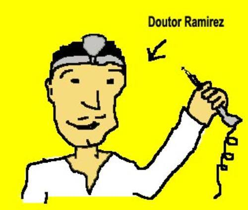

Houve o dia em que o Monstro precisou ir ao dentista. Tudo começou há 48 anos,quando ele comia um torrão de açúcar. Uma grande e melada pedra de açúcar. Nosso monstro, com toda a sua distração, esqueceu-se de mastigar direito porque estava na hora de sua novela, e eis que deposita-se um grande pedaço do doce em sua cavidade da gengiva, lugar onde em tempos ancestrais usavam nascer sisos monstros. E lá ficou alojado até que um dia veio a cárie. E depois outra. E mais algumas. E na época em que ele efetivamente decidiu ir ao dentista havia delas uma colônia inteira. Haviam construído vilas e sistemas de cooperativas agrícolas nas sesmarias doadas pelo imperados Cárie. Tinham instaurado um sistema imperial democrático, com eleições de três em três Xipins (o ano-cárie). Já não precisavam de comida externa, produziam seu próprio alimento. E possuiam o mais completo sistema rodoviário da comunidade cárie, assim como um eficiente sistema de correios e telégrafos e um espetacular complexo de saneamento básico.
O monstro decidiu por tratar de seus dentes quando começou a sentir dolorosas pontadas na garganta e em seu céu-da-boca. Eram as cáries que, por causa de um visionário, decidiram por desconfiar que havia algo mais além de seu mundo, e contruíram então máquinas voadoras para extrapolá-lo. Antes que essas máquinas se tornassem avançadas o Monstro foi visitar o doutor Ramirez, seu odontologista.

Olá monstro meu velho, Olá doutor como está, Provavelmente melhor que você, devido à sua cara hahaha. Mas o Monstro não estava para piadinhas e comeu a cadeira dele. E já palitava os dentes com uma broca quando Ramirez disse-lhe para abrir a boca.

Ele olhou para dentro da boca do Monstro e pasmou. Olhou por muito tempo, maravilhado. As cáries tentavam se recuperar do último cataclismo em seu mundo, acreditando que a passagem da cadeira de dentista e o abalo sísmico causado pelas brocas eram castigos dos deuses. Algumas profetizavam o apocalipse, outras faziam oferendas, algumas mais cometiam Haraquiri. E já tratavam de reconstruir a sociedade e implantar racionamento de emergência quando o doutor muniu-se de suas ferramentas mais complexas e pôs-se a interferir no processo. Claro, antes de começar a eliminar as cáries ele esculpiu algumas casinhas para elas e causou alguns dilúvios, só de sacanagem. Mas o monstro estava impaciente com aquele barulhinho insuportável e seu olho esquerdo pisacava compulsivamene. O doutor então preocupou-se com isso e fez logo uma limpeza geral. Era o fim do Império Democrático das Cáries.

O monstro estava um dia desanimado, e todos sabem que quando ele tá desanimado ele vai a seu quarto estudar física. Entrou correndo para começar a brincar com seu gerador de Van der Graff quando tropeçou em um taco solto no canto do chão. Estranho. Atípico. Muito misterioso.
Há coisas que não devem ser descobertas. Que adormecem no mais obscuro lado da metafísica, e que devem ser enterradas no abismo infinito do esquecimento, no silêncio inaudível de tudo aquilo que não se explica. Que não deve ser explicado. Que é maior que qualquer explicação.
Mas o taco estava solto. E foi arremessado longe. E o Monstro picado por uma curiosidade impetuosa foi olhar para dentro do buraco que se abrira. E ele sentiu em seu fígado que o que havia ali era algo mais que o que a sua compreensão poderia assimilar.

Havia um objeto. Um objeto feito com a mais pura magia e elementos ocultos da ciência ancestral. Um objeto que até hoje causa a dúvida e a insanidade em quem com ele tem contato. Que se tenta explicar mas faz parecer brinquedo a mais extraordinária matemática. Era circular. Como um aro feito com uma fita achatada. Mas as pontas prendiam-se invertidas, causando uma torção em toda sua extensão. E voilá. Um aparato aparentemente simples que desperta tanta discórdia e desamparo. Tanta angústia e medo.

Veio o Monstro a descobrir o nome de seu criador: Möbius. E o nome do objeto: Anel de Möbius. Havia com o artefato um tratado com informações a respeito.

E nosso protagonista resolveu embrenhar-se no caminho incerto da ciência do anel e pôs-se a executar as experiências contidas no livro, que aparentemente sabia de muita coisa.

Primeiro passo. Pegou uma tesoura e colocou-se a cortar o anel exatamente no meio, do começo ao fim. "Vou fazer dois anéis" - pensou. Mas ele estava enganado. O ciclo da natureza do anel já começava-se a inverter, e toda a atmosfera ficou tensa. Terminou de cortar, e ora! O anel cortado ao meio tranformou-se em... um outro anel. UM outro anel. Maior que o primeiro, como se não bastasse.

Passo segundo. Tomou novamente a tesoura em mãos e deu início a um novo corte, no meio do novo anel que se formara. E qual não foi sua surpresa ao constatar que, ao invés de se tranformar em um anel maior, tornara-se uma corrente de dois elos, dois anéis entrelaçados.

O misticismo do Monstro era pouco para crer no que havia diante de seus olhos.

Terceiro corte.

Foi então que soube. O presságio do Monstro estava certo. E não havia dia mais propício para que o destino cumprisse seus desígnios.A luz se acendeu e o Monstro chorou de desespero. E urrou, emudecendo toda a atmosfera a sua volta. Ele via, era o caos. Foi então que, notando tudo arruinado ao seu redor, confirmou seu pressentimento: havia esquecido uma caixa de refrigerantes no freezer. Os congelamentos e explosões sucessivos inundaram e emporcalharam toda a cozinha, com uma intensidade jamais vista por alguém. E a espuma gélida e úmida estalava, debochando de seu irreparável descuido.O Monstro nunca soube muito bem lidar com seus sentimentos, e em um misto de raiva e desgosto, decidiu que o que sentia realmente era solidão. Uma solidão infinita, que o corroía por dentro naquele momento. Foi então que deitou novamente em sua cama e morreu sozinho. Com a maior solidão já vivida por algum monstro.Tudo o que sobrou do Monstro no mundo foi uma lápide de origem duvidosa.

Assim, remoendo dúvidas, concebendo agouros, com o pior dos pressentimentos, deixou seu quarto e se deparou com o escuro e o frio daquele dia peculiar. Era o último, ele sabia. Era o último tapete. Guiando-se cego pela falta de luz, sabia que após aquele tapete a sala terminava. Ali ele encontraria o fim. O definitivo fim. E o começo da cozinha.Na cozinha, descalço, pisando poças geladas e apalpando as paredes, procurava o interruptor. Bastava para isso seguir as faíscas que brotavam quentes e luminosas da parede. Sua cabeça doía. Sua mão inquieta aproximava-se do interruptor de luz em curto-circuito. Ele tinha uma sensação ruim, sua mão se aproximava. Seus pés molhados tremiam, assim como seus bigodes e seu destino. Estava já a um palmo de acender a luz e lembrava-se de seu passado. E queria ter ajudado mais os monstrinhos carentes que punha pra trabalhar nas fornalhas de carvão. E então foi. Em um ímpeto de vontade, esticou a mão e pressionou com força o interruptor defeituoso. Foi então que aconteceu. Dizem que nesse exato momento um coro de mil vozes em desespero pôde ser ouvido durante uma fração de segundo, e todas as pedras choraram em delírio.

Era terca-feira. Os primeiros raios baços da manhã esforçavam-se por sussurrar sua melancolia ao horizonte. Tudo era frio, escuro e nebuloso, com quantas cinzentas e misteriosas névoas o dia podia lidar. Um dia ímpar. Um dia que mais parecia um outro lado da noite, expirando seus irreprimíveis delírios. Tudo era silêncio. Uma calmaria duvidosa, perturbadora, que derrubava-se em uma total falta de som. E aquele silêncio era uma nova forma de grito, e em si continha toda a angustiante dor daquela manhã de sombra. Os pássaros que ousaram despertar contorceram-se em segredos descobertos e morreram de loucura, descaindo um a um de seus ninhos. O orvalho frio imprimia sua falta de substância em cada coisa, e maltratava a cada segundo mais um espaço do dia, aproveitando-se do escuro para torturar com seu gelo insistente cada planta que já padecia com a falta de luz. Descortinava-se uma atmosfera de dúvida e medo, de treva e desolação. Cada uivo que a terra lançava levava consigo uma resma de esperança. E só o que crescia era a tristeza.

"Assim eu quereria minha última crônica: que fosse pura como esse sorriso" - disse uma vez Fernando Sabino, um renomado poeta monstro. O Monstro Verde, que não suporta essa ladainha de ficar anunciando finais sem acabar realmente, picou, refogou e comeu com aspargos o poeta, para que aquela fosse, de fato, a sua última crônica. e até hoje não se perdoa por não ter comido também Oscar Schmidt, depois que ele anunciou pela primeira vez seu desligamento definitivo do basquete.O que o Monstro não imaginava é que ele, o Incrível, o indiscutível, o todo-poderoso Monstro Verde teria também seu ocaso. E assim, numa premonitória manhã que discretamente abotoou na história, veio à tona um fim.Nem todo fim é um começo.
Como o Monstro Verde não tinha muita experiência em torturas e técnicas de coerção, tentou a terapia de choque de diversas maneiras, em vários locais e com diferentes intensidades.No começo, o efeito não era muito satisfatório, com os primeiros choques Melissa enrolava os bigodes, eriçava o pêlo do nariz, ejaculava e começava a cantar boleros. Mas com o desenvolvimento da técnica, o Monstro conseguiu fazer com que ele caminhasse vinte metros arrastando a língua no chão, girasse em torno de seu próprio eixo, pulando e falando que era uma aranha, engolisse uma pata até o cotovelo para depois tornar a cuspi-la e cantar "Ragatanga" de trás pra frente, trocando as sílabas tônicas por palmas e fazendo a coreografia ao mesmo tempo com as patas de trás. E o Monstro achou aquilo divertidíssimo e filmou para mandar pra um show de talentos.Desnecessário dizer que Melissa 297 ganhou com honras, e após isso ele seguiu uma carreira de sucesso em Hollywood, e seu nome ficou conhecido no mundo todo. Isso durante quarenta dias, antes de morrer engasgado com um sanduíche de atum.

Um tigre-de-bengala. Não, velho não era, a bengala era por causa de um reumatismo que incomodava quando o tempo estava úmido. E também para fazer charme. Era um tigre por demais charmoso, cheio de estilo. E másculo e imponente, como poucos. O Monstro ficou encantado com sua nova aquisição, e o levou pra casa. E deu-lhe o nome de Melissa 297.Venha Melissa, vamos correr, Grrrrrr...., Vamos, não tenha vergonha, olha, vai buscar o pauzinho, tá bom, Grrrrrrrr.... grr....., Vai, Melissa 297, seja um bom menino, senta! senta!, não, não faça isso, deixe esses cachorros em paz, vai estragar seu apetite.E o Monstro entristecia quando o tigre não colaborava. Mas a verdade é que Melissa 297 não se interessava por esportes, nem era muito sociável. Vivia só, em seu canto, em seu mundinho particular, estudando mitologia gaélica e recitando trechos da literatura mundial em esperanto. O Monstro então se sentiu desafiado e resolveu partir pra práticas extremas, como a terapia do eletrochoque.

E o Monstro tinha dó de destruir tão fantástico instrumento, quando decidiu-se por cortá-lo ao meio uma vez mais. E essa foi uma decisão que mudaria completamente as coisas. Que faria o Monstro ver a mundo de outra forma. Ao terminar o corte, viu-se um flash intenso, e tudo foi azul por uns segundos. Já não se ouvia o soar dos brócolis. Quando o monstro recobrou sua consciência, quem estava diante de si - Möbius, em pessoa. E este último começou a falar, com emoção: "Oh, que felicidade, esperei muito tempo por esse dia, finalmente alguém conseguiu entender o meu anel e dar vida à pesquisa que eu levei toda a vida para finalizar, você é meu libertador, vou lhe dar todo o conhecimento que quiser, vou lhe ensinar o segredo da juventude e do fogo eterno, vou lhe fazer entender por completo uma mulher e como se joga uma partida de Korfball, como achar os jacarés que voam e domá-los até que virem dragões, como flutu..." Mas o monstro não entendia alemão e achou que ele falava muito esquisito. Então comeu o cientista e nunca mais ouviu falar do tal anel.O Monstro um dia percebeu que estava muito sozinho e carente, e resolveu arrumar companhia. Alguém que o acompanhasse nas horas mais penosas, alguém sincero e honesto, uma amizade verdadeira. Foi então à loja da dona Perdizes e comprou um tigre. Era grande e lustroso, o animal.

Munido de sua tesoura novamente, já recuperado do último resultado, recomeçou a mesma rotina de cortar ao meio os anéis. E quando partiu o último pedaço, nada mais óbvio: Tudo transformara-se em um pato. Digo, não tudo, o Monstro ainda era um monstro e sua casa ainda era somente uma casa. O que se tranformou em pato foi o objeto misterioso, o velho McMill que neste mesmo momento vestia uma fantasia para entreter crianças, e a velha esquisita do quarto andar. Essa virava pato de vez em quando, não tinha necessariamente uma relação com o anel.Cortando ao meio pela quarta vez, já achando a brincadeira divertida, o Monstro obteve nada menos que quatro brócolis, que faziam barulho de sino quando tocados. — em Uriak, Normandia.