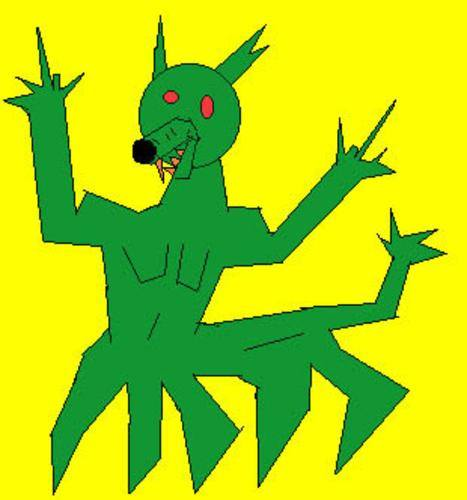

Há muito tempo, quando o mundo não era mais que algum preenchimento no nada, vivia nosso protagonista. E seu habitat era a floresta de Uriak, na Normândia Ocidental. E ele não tinha nome. E ele comia pedras.

Lá na Normândia, vivia nosso amigo em sua caverna, que ficava exatamente 100 metros abaixo da terra. De lá tirava ele todas as pedras necessárias a seu sustento, sua preferida era a hematita.
Era um monstro solitário, enfim. A verdade há de ser dita. Mas não deixava de dar suas festinhas de tempos em tempos. E sua estação predileta era a primavera, e sua parente predileta era a prima Vera. E conhecia muita gente da comunidade Monstro. E tinha também seus coleguinhas da floresta. Era um monstro muito sociável, afinal. Certo, talvez não fosse ele tão solitário. Mas já dizia Richard Blenn: "Todo solitário é um sonhador". E o monstro era um sonhador.

Manhã de 25 de Maio de 1864: estava lá nosso monstro em cima de seus tornozelos e perto do vaso chinês, em frente ao vestíbulo - ele cortava suas unhas. A tesoura era uma Walita T-987 ("Mais confiança e durabilidade"). Seu pescoço tinha uma mancha azul com a forma da itália. Ou de um pato. E ele bocejava sua falta de pensamentos. Incrível o que a memória pode trazer à tona. (malditos flashbacks)

Houve um dia em que o monstro precisou da assinatura do Jonathan. Mas a questão é que Jonathan não existia. Isso constituiria um problema, é claro. Mas não para o nosso querido monstro, que conhecia um estratagema.

Jonas Donizeti era o estratagema que todos queriam ter. Ele era bonito, gordo, viçoso e cheirava a mobim; gostava de baião, new age e palavras como "bujão", "agogô", "lambari" e "purungo". Jonas não sabia inglês, não sabia como era possível roubar toda a decoração de um MacDonaldŽs sem se ser pego, não sabia a diferença entre uma camisa e uma camiseta, não entendia a função dos pernilongos na cadeia alimentar e também não sabia por que a água girava sempre pro mesmo lugar em seu hemisfério. Mas Jonas sabia uma coisa. Que nunca, sob hipótese alguma, deveria se misturar alcino policloretídico com diclofireno de benzanoato dentro de um Erlenmeyer. Não, isso nunca.

Seu melhor amigo, entretanto, era o desembargador Mendes Sá.
O grande desembargador gostava de poemas.

Enfim, retornemos. O monstro, ele tinha um carinho especial por bichinhos de estimação. Carinho que dedicava ao George e ao Clooney, seus pôneis; ao Jim e ao Morrisson, seus ewoks; e à Samantha e à Margarida, suas lacraias. E eis que, por volteios do destino, vieram Samantha e Margarida a ter um filha. Ela cheirava a alecrins e falava engraçado. E quando ficou grande mudou-se para África e tornou-se a primeira ditadora negra do Quênia.

Mas nada disso vem ao caso. O caso ainda não estava solucionado.
No dia fatídico o careca passara frente à floricultura. Era noite. Ele tinha um sobretudo bordô, um queixo quadrado e uma cara holística. Chegou em casa instantes depois. Tantos instantes quanto o tamanho da avenida Apolo de Rotterdam. O careca lia Kafka. Seus filhos menores chamavam-se Processo e Metamorfose.

-Silk!

-Garf!

-Silk! Você sabe quais eram o nomes dos sete anões?

-Zinn! Mestre, Soneca, Feliz, Dunga, Zangado e Atchim. Silk.

-Ghag! Graf! Falta um.

-...

-Dengoso.

-Hiinf. Sempre me esqueço desse aí.

"Malditas sanguessugas. Comeram toda minha alface." - o monstro acordara de mau humor. E ele nem gostava de alfaces.

Por falta do que fazer, ele mancava de uma perna. Comeu algumas pedras e pos-se a jogar jogo da velha. Estava ganhando de 5 a 2, quando sua avó ligou: "Você viu minhas violetas por aí, Não, vovó não vi, Que coisa estranha, elas estavam aqui ainda pouco, A senhora já olhou em baixo do moedor de cana, Não, boa idéia, obrigada, tchau, Tchau"

-Por aqui, que ela não está olhando

°Não, vamos embaixo do moedor de cana!

-Lá vem ela olhar, estúpida. Se abaixe.

°Por que você tem sempre que ser a líder?

-Porque eu consigo fazer isso. Observe.

ºOh!

¬Oh!

§Meu Deus!

-Vamos agora. Apaguem seus rastros.

E elas foram. Teníria, a líder do grupo, teve uma carreira de sucesso e foi morar em Massachussets, onde cultivou begônias e escreveu sua biografia.
As outras descobriram o ópio e nunca mais foram as mesmas. — em Uriak, Normandia.