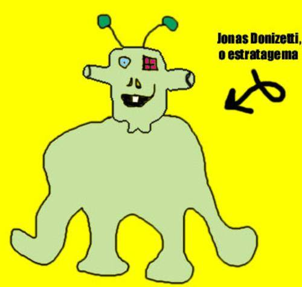

9:34 - Ele continua vagando pela alameda. Sua careca se destaca por sobre seu casaco bordô.

19:42 - O homem se abaixa e olha para os lados. Gesto suspeito, código beta 3. Retoma sua caminhada.

19:57 - Entra na casa, floreira com petúnias. Número 197. Grita "Ni!" para os transeuntes que passavam. Gesto altamente suspeito,código omega 82. Pega a chave debaixo do capacho.

19:50 - Fomos atingidos por uma distorção espaço-temporal. Retornamos as 19:50. Graças às minha anotações estou ciente disso.

19:57 - Entra na casa; floreira com petúnias. Número 197. Grita "Ni!" para os transeuntes que passavam. Gesto altamente suspeito, código omega 82. Pega a chave debaixo do capacho. De novo.

20:31 - Tudo quieto. Ainda acho que foi o mordomo.

20:54 - Está óbvio que ele não é o Jonathan.
O monstro se sentia inseguro às 20:39. Por isso, ia para cama, inexoravelmente, às 20:30. No dia seguinte, acordaria cedo e assistiria desenhos animados.

O seu favorito era "Caverna do Dragão", até que lhe contaram que o Mestre dos Magos era malvado e o Vingador só queria o bem das personagens. Ele entrou em depressão e por três meses parou de comer brócolis. Quando soube, então, que o Uni era um unicórnio diabólico, que todos as personagens haviam, na verdade, morrido no primeiro capítulo e viviam agora no purgatório para redimir seus pecados; e que o senhor que dublava Presto morrera de Ebola, o monstro decidiu recorrer às drogas pesadas para curar a profunda depressão. Começou, daí, a ouvir Reginaldo Rossi, Carmem Miranda e Maria Bethânia em doses cavalares. Chegou então ao fundo do buraco, que ficava 200m abaixo de sua residência anterior.

Lá encontrou mais hematita e também o correligionário Juarez Garcia y Garcya, que o convenceu a livrar-se das drogas e a jogar cricket aos domingos.

(cena: o monstro, passeando pela casa, entra na cozinha; crutons e outras guloseimas estão postas sobre a mesa)

Monstro: (entra, olha para os lados. Faz uma cara pensativa, come um cruton) Às vezes, eu não queria ser eu. Às vezes, mas só às vezes, eu queria ser uma libélula selvagem, livre, dessas que saem voando por aí, só pra ter uma memória que dura aproximadamente 87 milésimos de segundo e cruzar com todas as fêmeas que cruzassem meu percurso.

Monstro: (Se levanta, olha com cara incrédula para o local onde antes se encontrava) Ha! Você deve estar louco! Que idéia sem cabimento!

Monstro: (retorna ao seu assento, morde mais um cruton) Sim... talvez eu seja louco. Mas, afinal, quem não é? O ar quente dessa sala é frio na parte que toca a alma. Mas existem tantos por aí, tantos que falam sozinho, consigo, dialogando internamente... e são eles considerados loucos por isso?

Monstro: (se levanta, vai até a porta, ri) Há há há! É claro! Você acabou de descrever um caso típico de esquizofrenia multipersonal.
(o monstro cala, reflete e diz)
Falando no diabo, está na hora das pílulas vermelhas.

Monstro: (senta, faz birra) Ah, as vermelhas não! Eu já tomei elas ontem!

Monstro: (levanta-se, irritado) Vamos, homem! Você tem medo, é isso? Então quer dizer que o bravo monstro verde comedor de pedras, é, na verdade, medroso como uma donzela? Você é um monstro de verdade ou simplesmente uma mutação de quinta categoria de algum filme B?

Monstro: (contrariado, pega as pílulas) Não é isso. (Engole as pílulas) Pronto. Eu só não queria ficar sozinho. Mas, enfim, você voltará.
(uma lagrima brota do olho carbuncular do monstro) Adeus, Sebastian.

Monstro: (sumindo) Adeus, monstro.
O monstro realizou que a vida era um silogismo, e que as premissas nunca afirmavam a veracidade das conclusões. Decidiu dormir, então.
Quando acordou, sentiu fome, e foi procurar hematitas num campo distante. Lá encontrou um sujeito intrigante, cujo nome era Ó de Almeida.

O sr. Ó de Almeida passava as horas vagas cultivando centeio ou fazendo pão-de-ló, para depois jogar tudo no rio e compor poemas enquanto a comida afundava. O monstro até escreveu um outro poema para acompanhar o Sr. Ó de Almeida, mas ele ficou tão ruim, mas tão ruim, que o monstro teve de eliminar o sr. Ó de Almeida para que nunca ninguém soubesse da existência dessa manifestação artística.
O monstro sentia um enorme vazio existencial por não saber jogar futebol. Então quando não estava estudando, procurava suprir esse vazio de outras formas. Em um dia excepcionalmente angustiante, para sentir-se melhor, o monstro comeu dois biscoitinhos da sorte, pintou suas unhas de vermelho, deixou crescer o cavanhaque, inventou uma palavra e comprou uma mobilete pra sua sobrinha.
Após isso, foi ao seu quarto de estudo aprender física. Eletrodinâmica lhe dava intensos calafrios, e seu maior sonho sempre fora possuir um gerador de Van der Graff Passava horas tentando compreender a Lei dos Nós.

9 de Janeiro: dia do Incrível Guizado Especial de Pedras do monstro verde. Dia sagrado. Fartura e pujança para toda a família. Pôs-se o monstro a prepará-lo. — em Uriak, Normandia.