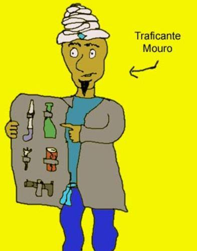

Eis que surge, senão quando, alguém que mudaria a vida do Monstro para sempre. Ele era gordo. Ele era grande. Ele tinha bigodes. Ele era vil e desprezível. Ele não sabia a tabuada do 7. Ela não cabia na sua cama. Ele gostava do Gargamel. Ele era o Incrível Monstro Amarelo Comedor de Araucária. E por isso mesmo tornou-se do monstro o arquiinimigo.

E ele veio um dia ao monstro. E ele vinha imaginando coisas. Ele veio com seu pijama de seda invisível. Mas o Monstro Verde o viu mesmo assim. Ele estava nesse dia por demais perspicaz. Estavam sem graça. O Monstro Verde comia azeitonas e olhava de soslaio. O Amarelo trazia na mão um chumaço de araucária. E desenhava na areia com seus pés.

E foi nosso Monstro Verde que quebrou o gelo. E quebrou também o copo. E a mesa e tudo o que estava por perto. Resolveu demonstrar poder e virilidade para marcar seu território. Inflou o peito e começou o canto da dominação, fazendo barulhos estridentes com a língua. Girava sobre seu próprio eixo. O Amarelo assustou-se de tal modo que começou a sacudir as pernas e apelar também para seus mais primários instintos. E babava um fluido amarelo. E cheirava a gorgonzola. Ficaram nessa durante quarenta dias e quarenta noites, até que se agacharam no chão em posição de guarda. O Monstro Verde bufava. O Monstro Amarelo cheirava a gorgonzola, ainda. E o inimigo falou.

-Você já era, Verde. Te deixarei vermelho de desgosto com meu poder.

-Não me venha com ladainhas. A araucária nunca irá dominar as pedras, assim como as toupeiras sempre acham o caminho de volta pra casa. Isso é um fato. Não se vai contra os fatos. Você nunca teria o poder que diz que tem se eu não o tivesse única e verdadeiramente.

-Estou confuso.

-Vê? É o efeito da derrota iminente. Você perderá assim como as toupeiras sempre acham o caminho de volta para casa.

-Pare com isso!! Ou eu te destruirei com minhas garras de força e destruição!!

-Quanto é sete vezes oito?

-Aarrrhhhhh nãooooooooooo!!!!!!!!! Nãooooooooooo!!!! não a tabuada do seteeeeeee......

E urrou. Urrou como o morro dos ventos uivantes. E estava perdido no mundo e não mais sabia quem era. E chorou lágrimas amarelas. Depois disso cuspiu no chão e foi embora pra casa, jurando vingança.

O monstro alugou alguns filmes de cowboy para assistir e empolgou-se como os duelos do faroeste. Esse lugar é pequeno demais para nó dois, bate porta do saloon, feno rolando pela estrada, dez passos pra frente, vira saca e atira, essas coisas todas. E teve ele então a brilhante idéia de desafiar alguém para um duelo. O Íncrivel Monstro Amarelo Comedor de Araucária estava sumido. Juarez Garcia e Garcya estava em um campeonato de cricket. O careca e seu sobretudo bordô estavam sendo vigiados. E do Jonathan, ninguém sabia.

Foi então que por um meneio sinistro do destino veio o Monstro a saber da fabulosa lenda de Hernandez Marcapasso. E sentiu-se tão vil e pequeno diante dele que desistiu de seus planos de duelar.

Agora o monstro era só desolação. Havia tempos que estivera apaixonado pela menina que figurava em sua caixa de cereais favoritos, e decidiu procurá-la para que pudessem se casar. Mas os atendentes da empresa onde o cereal era fabricado disseram que aquela menina não existia. O pior, afirmaram que ela não era nem mesmo uma menina, mas sim uma cenoura besuntada em guache bege e disfarçada com apetrechos da Barbie.
O monstro então comeu os atendentes, desmembrou o proprietário, tocou fogo na fábrica, jogou sal grosso e cal no terreno e foi numa pomba-gira amaldiçoar até a décima-sétima geração de todos os que lá trabalhavam com o mesmo infortúnio que assolou durante 61 equinócios e 61 solstícios o grave Coronel Humberto Carne de Sol.

Houve num tempo distante quem dissesse que o Coronel Humberto Carne de Sol nunca existiu. O que não deixava de ser verdade, dado que ele ainda não havia nascido nessa época. Mas num tempo não tão distante, todos conheciam e temiam o grave coronel e seu séqüito de maldições.

Por já haver ofendido a um alquimista, desrespeitado um pai-de-santo, chutado o gato de uma bruxa, usado o chapéu de um mago como coador de café, rido da filha de um troll e professado cantos pagões na frente um guru espiritual, o rol de desgraças que acompanhava Carne de Sol era fornido. A mais famosa e terrível das maldições, entretanto, provinha de um escravo tútsi que o coronel havia trocado por um lenço usado e três pilhas de qualidade duvidosa com um traficante mouro.

Certo dia, enquanto o escravo cumpria seus afazeres, o coronel resolveu ferver piche num caldeirão. E deu para seu servo beber, e ficou rindo ao passo que a massa negra vazava uniformemente pelo corpo daquela criaturinha esquisita. Contudo, antes de morrer, o escravo escreveu com seu sangue em si próprio a si mesmo três palavras arcanas num dialeto hutu esquecido; e a mais terrível das maldições fora lançada. E era tão tenebrosa, mas tão tenebrosa, que só seu nome já havia causado a morte de uma vila inteira.

A toca era coberta por parasitas de todas as raças. Um bocado do que de mais asqueroso havia por aquelas florestas. Eram orquídeas, plantas carnívoras, cipós-invasores, piolhos-de-cobra, sanguessugas, asquelmintos, bernes, filárias, pulgas, fungos, 194 tipos de vírus e uma sogra. Viviam todos sobre um grande e repugnante quimo formado pelos próprios habitantes da caverna. E o interessante é que eles se-auto-parasitavam-a-si-próprios-em-si-mesmos-uns-aos-outros, o que tornava possível o equilíbrio daquele ecossistema e do quimo viscoso.No fundo da caverna, sobre um altar pagão com um crânio de rato encrustrado, dormiam elas, as três Raposas-de-Utnapishtim. Elas que davam refúgio livre aos parasitas desospedados. E eram, bem como diziam, um tanto quanto tortas. A do meio parecia ser a mais velha, pelo tamanho da sua barba. Ela era torta para a direita. A segunda raposa era magra como uma costela de musaranho. E torta para a esquerda. E a última delas, ah, essa era incrivelmente torta. Indescritivelmente torta. Quase mais torta que uma torta de amora.Gilgamesh espantou-se e não conseguiu usar a espada, que estava sendo parasitada por um grupo de piolhos famintos. Aproximou-se então das raposas e jogou sal sobre seus olhos. Foi seu derradeiro erro. A maldição estaria, desde aquele momento, lançada para todo o sempre. E o mundo descobriu que nunca se deve jogar sal nas Raposas-de-Utnapishtim.

Tarde demais.

Era Ela. A maldição das Três Raposas Tortas.Nada podia resolver o incrivel infortúnio que acompanhava Humberto Carne de Sol. Todos os curandeiros procurados por ele morriam antes de ouvirem sua história. A mandinga era extremamente forte. E as mortes, as mais tenebrosas. O último pai-de-santo que tentou se aproximar do coronel engoliu seu próprio braço. Um outro cavou um buraco em sua própria cabeça com uma colher de chá. E assim a maldição prosseguia.Diz a lenda, com sua voz rouca de taquara rachada, que a maldição das Três Raposas Tortas teve início em tempos remotos, nas proximidades de Uruk, "onde os ursos dormem de olho aberto".Foi lá que Gilgamesh, o mau, compactuou com Humababa, o iníquo, tramando contra as misteriosas Raposas-de-Utnapishtim. Seu intento, era fazer um bonito casaco de pele de raposas, para dar de presente a sua criada, que era só sua criada. (Mal-criada, é o que diziam. )E para concretizar seu plano foi atrás da toca das misteriosas raposas. Lá chegando, Gilgamesh parou para espreitar o que acontecia. Ele levava a fabulosa espada de três pontas de Humababa, cujo gume nunca errara uma vítima. — em Uriak, Normandia.